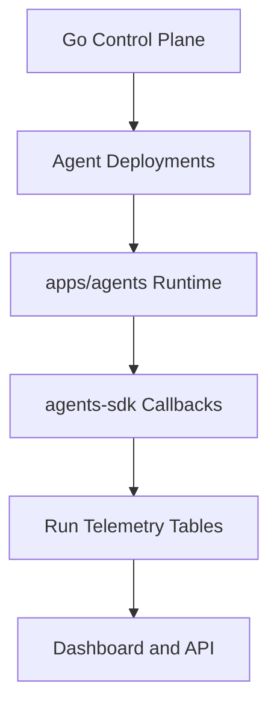

Strait provides a managed agent platform on top of the same job, run, and workflow substrate used by the rest of the system.

That gives agents:

- a dedicated control plane
- deployable runtime targets
- cost and usage tracking
- tool-call telemetry
- checkpoints and workflow state
- dashboard inspection and run debugging

without inventing a second execution model.

## Key Capabilities

<CardGroup cols={2}>
  <Card title="Managed Agents" icon="robot" href="/docs/concepts/agents">
    Define agents as managed resources with deployments, runs, and hidden backing jobs that reuse Strait's existing run lifecycle.
  </Card>
  <Card title="Cost Budgets" icon="dollar-sign" href="/docs/concepts/cost-budgets">
    Set per-run spending limits. Strait tracks usage and can halt execution when budgets are exceeded.
  </Card>
  <Card title="Tool Call Tracking" icon="wrench" href="/docs/sdks/agents">
    Log every tool call an agent makes with input/output capture and latency metrics.
  </Card>
  <Card title="Checkpoints" icon="bookmark" href="/docs/sdks/agents">
    Save agent state at any point. Resume from the last checkpoint on failure instead of restarting.
  </Card>
  <Card title="Workflow Orchestration" icon="code-branch" href="/docs/concepts/workflows">
    Use agents inside workflows, share workflow state, and expand DAGs dynamically from planner-style steps.
  </Card>
  <Card title="Local-First Runtime" icon="terminal" href="/docs/guides/local-agent-development">
    Develop agents locally through `apps/agents` and `@strait/agents` before deploying to Cloudflare.
  </Card>
  <Card title="Cloudflare Runtime" icon="cloud-arrow-up" href="/docs/guides/cloudflare-agents-productionization">
    Deploy versioned runtime Workers, route runs through a dispatch Worker, and enforce outbound egress policies.
  </Card>
</CardGroup>

## How It Works

1. Create an agent through the management API or dashboard.
2. Deploy the agent to a local or Cloudflare runtime target.
3. Trigger a run against the latest deployment.
4. The runtime reports checkpoints, usage, tool calls, stream chunks, and terminal status through the run-token callback API.
5. Strait persists that telemetry in the standard run tables and exposes it in the dashboard.

## Platform Layers

### Go Control Plane

The control plane owns:

- agent records
- deployment records
- provider selection
- run creation
- persistence and telemetry ingestion

### Runtime Package

`apps/agents` contains:

- local CLI runtime
- Cloudflare runtime Worker
- Cloudflare dispatch Worker
- Cloudflare outbound Worker

### Runtime SDK

`@strait/agents` provides:

- `StraitContext`
- provider adapters
- budgets and pricing
- workflow helpers
- eval helpers
- sandbox metadata

## Where To Start

<CardGroup cols={2}>
  <Card title="Agents Concept" icon="layers" href="/docs/concepts/agents">
    Start here for the system model, deployment contract, runtime lifecycle, and workflow integration.
  </Card>
  <Card title="Agent API Guide" icon="terminal-window" href="/docs/guides/agent-api">
    Use the management API to create, deploy, run, and inspect agents.
  </Card>
  <Card title="Agents SDK" icon="code" href="/docs/sdks/agents">
    Learn the runtime-side TypeScript API for logs, usage, checkpoints, tools, and workflow state.
  </Card>
  <Card title="Local Development" icon="laptop" href="/docs/guides/local-agent-development">
    Follow the contributor loop for local development, testing, and dashboard dogfooding.
  </Card>
</CardGroup>

## SDK Support

For the managed runtime path in this repository, the primary runtime integration is:

- [`@strait/agents`](/docs/sdks/agents)

It is built specifically for the `/sdk/v1/runs/{runID}/...` callback endpoints used by executing agent runs.

## Related References

- [Agents](/docs/concepts/agents)
- [Agent API Guide](/docs/guides/agent-api)
- [Agents SDK](/docs/sdks/agents)
- [Local Agent Development](/docs/guides/local-agent-development)
- [Cloudflare Agents Productionization](/docs/guides/cloudflare-agents-productionization)
