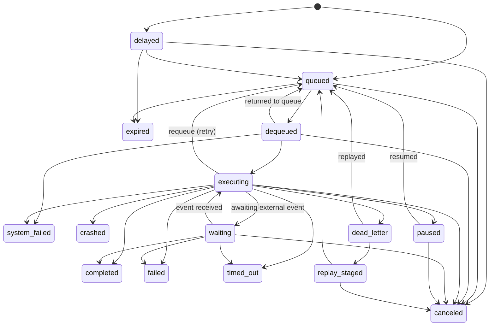

Strait stores all state in Postgres. There is no ORM — all queries run through `pgx/v5` with hand-written SQL in the `internal/store` package. This page documents the schema at a conceptual level: what the tables represent, how they relate, and the design decisions behind them.

## Core Tables

Three tables form the backbone of every Strait deployment.

### projects

The top-level tenant boundary. Every other table carries a `project_id` foreign key.

| Column | Type | Notes |
|---|---|---|
| `id` | `TEXT PK` | NanoID |
| `org_id` | `TEXT` | External organization identifier (from auth provider) |
| `name` | `TEXT` | Human-readable project name |
| `created_at` | `TIMESTAMPTZ` | |
| `updated_at` | `TIMESTAMPTZ` | |

A companion `project_quotas` table stores per-project limits (`max_queued_runs`, `max_executing_runs`, `max_jobs`, `timezone`).

### jobs

A job is a named, versioned unit of work with an HTTP endpoint. Jobs belong to a project and are identified by a unique `(project_id, slug)` pair.

| Column | Type | Notes |
|---|---|---|
| `id` | `TEXT PK` | NanoID |
| `project_id` | `TEXT NOT NULL` | Owning project |
| `name` / `slug` | `TEXT` | Human name and URL-safe identifier |
| `endpoint_url` | `TEXT NOT NULL` | Where Strait sends the execution request |
| `cron` | `TEXT` | Optional cron expression for scheduled runs |
| `max_attempts` | `INT` | Default 3 |
| `timeout_secs` | `INT` | Default 300 |
| `enabled` | `BOOLEAN` | Soft-disable without deleting |
| `payload_schema` | `JSONB` | Optional JSON Schema for payload validation |

Over 219 migrations, the jobs table has grown significantly. Notable additions include:

- **Concurrency controls**: `max_concurrency`, `max_concurrency_per_key`, `rate_limit_max`, `rate_limit_window_secs`
- **Retry strategy**: `retry_strategy`, `retry_delays_secs`, `retry_priority_boost`
- **Versioning**: `version`, `version_id`, `version_policy` (with a separate `job_versions` table)
- **Execution mode**: `execution_mode`, `machine_preset`, `image_uri`, `region`
- **Job chaining**: `on_complete_trigger_job`, `on_failure_trigger_job`, `on_complete_trigger_workflow`
- **Batching and debounce**: `batch_window_secs`, `batch_max_size`, `debounce_window_secs`
- **DLQ thresholds**: `dlq_alert_threshold`, `poison_pill_threshold`, `queue_depth_alert_threshold`
- **Code deployments**: `source_type`, `runtime`, `active_deployment_id`

### job_runs

Every triggered execution of a job produces a run. This is the highest-write-volume table in the system.

| Column | Type | Notes |
|---|---|---|
| `id` | `TEXT PK` | NanoID |
| `job_id` | `TEXT NOT NULL` | FK to `jobs` |
| `project_id` | `TEXT NOT NULL` | Denormalized for fast filtered queries |
| `status` | `TEXT NOT NULL` | Current lifecycle state (see [Run State Machine](#run-state-machine)) |
| `attempt` | `INT` | Current attempt number (1-based) |
| `payload` | `JSONB` | Input data |
| `result` | `JSONB` | Output data (set on completion) |
| `error` | `TEXT` | Error message on failure |
| `triggered_by` | `TEXT` | One of: `manual`, `cron`, `spawn`, `workflow`, `retry`, `debounce`, `job_completion`, `job_failure`, `job_chain` |
| `priority` | `INT` | Higher values dequeue first |
| `idempotency_key` | `TEXT` | Deduplication within the dedup window |
| `scheduled_at` | `TIMESTAMPTZ` | For delayed runs |
| `started_at` | `TIMESTAMPTZ` | When execution began |
| `finished_at` | `TIMESTAMPTZ` | When the run reached a terminal state |
| `heartbeat_at` | `TIMESTAMPTZ` | Last heartbeat from the executor |
| `next_retry_at` | `TIMESTAMPTZ` | Scheduled retry time |
| `expires_at` | `TIMESTAMPTZ` | TTL expiration |
| `workflow_step_run_id` | `TEXT` | Links run to a workflow step (nullable) |

<Info>
  `project_id` is denormalized from `jobs` onto every run. This avoids a join on the queue hot path and enables Row Level Security (RLS) policies to filter by project without touching the jobs table.
</Info>

**Key indexes** on `job_runs`:

| Index | Predicate | Purpose |
|---|---|---|
| `idx_runs_queue` | `WHERE status = 'queued'` | Dequeue hot path (FIFO by `created_at`) |
| `idx_runs_project_status` | | Dashboard listing |
| `idx_runs_heartbeat` | `WHERE status = 'executing'` | Stale heartbeat detection |
| `idx_runs_expires` | `WHERE expires_at IS NOT NULL AND status IN ('delayed', 'queued')` | TTL reaper |

## Run States

Runs follow a 15-state lifecycle enforced in application code (`domain/fsm.go`). The state lifecycle is the single source of truth for which transitions are legal — the database stores the current state as a plain `TEXT` column, and every state change passes through `domain.ValidateTransition`.

**State categories** (defined as methods on `RunStatus`):

| Category | States | Method |
|---|---|---|
| Active (holds concurrency slot) | `dequeued`, `executing` | `IsActive()` |
| Claimable (eligible for dequeue) | `queued` | `IsClaimable()` |
| Failure | `failed`, `timed_out`, `crashed`, `system_failed`, `dead_letter` | `IsFailure()` |
| Terminal | `completed`, `failed`, `timed_out`, `crashed`, `system_failed`, `canceled`, `expired`, `dead_letter` | `IsTerminal()` |

<Warning>
  The `dequeued` state is a brief transitional state between dequeue and execution start. It exists so the system can distinguish "claimed but not yet running" from "actively executing" — important for crash recovery. If a worker crashes while a run is in `dequeued`, the reaper moves it to `system_failed`.
</Warning>

## Workflow Tables

Workflows compose multiple jobs into a DAG with dependency tracking and failure policies.

### workflows

| Column | Type | Notes |
|---|---|---|
| `id` | `TEXT PK` | |
| `project_id` | `TEXT NOT NULL` | |
| `name` / `slug` | `TEXT` | Unique per `(project_id, slug)` |
| `version` | `INT` | Incremented on schema changes |
| `enabled` | `BOOLEAN` | |

### workflow_steps

Each step maps to a job and declares its dependencies within the DAG.

| Column | Type | Notes |
|---|---|---|
| `id` | `TEXT PK` | |
| `workflow_id` | `TEXT` | FK to `workflows` (CASCADE delete) |
| `job_id` | `TEXT` | FK to `jobs` |
| `step_ref` | `TEXT` | Unique within the workflow |
| `depends_on` | `TEXT[]` | Array of `step_ref` values this step waits for |
| `condition` | `JSONB` | Optional conditional execution rules |
| `on_failure` | `TEXT` | `fail_workflow` (default), or other failure policies |
| `payload` | `JSONB` | Static payload override |

Additional columns added by later migrations support event-driven steps: `event_key`, `event_timeout_secs`, `event_emit_key`, `sleep_duration_secs`.

### workflow_runs

| Column | Type | Notes |
|---|---|---|
| `id` | `TEXT PK` | |
| `workflow_id` | `TEXT` | FK to `workflows` |
| `project_id` | `TEXT` | Denormalized |
| `status` | `TEXT` | Workflow state |
| `triggered_by` | `TEXT` | |

**Workflow Run States** (10 states):

| State | Transitions to |
|---|---|
| `pending` | `running`, `canceled` |
| `running` | `paused`, `completed`, `failed`, `timed_out`, `canceled` |
| `paused` | `running`, `completed`, `failed`, `timed_out`, `canceled` |
| `failed` | `compensating` |
| `timed_out` | `compensating` |
| `compensating` | `compensated`, `compensation_failed`, `canceled` |
| `completed` | (terminal) |
| `canceled` | (terminal) |
| `compensated` | (terminal) |
| `compensation_failed` | (terminal) |

### workflow_step_runs

Tracks each step's execution within a workflow run.

| Column | Type | Notes |
|---|---|---|
| `id` | `TEXT PK` | |
| `workflow_run_id` | `TEXT` | FK to `workflow_runs` (CASCADE delete) |
| `workflow_step_id` | `TEXT` | FK to `workflow_steps` |
| `step_ref` | `TEXT` | Denormalized for display |
| `job_run_id` | `TEXT` | FK to the `job_runs` row this step spawned |
| `deps_completed` | `INT` | Counter: how many dependencies have finished |
| `deps_required` | `INT` | Total dependency count |
| `status` | `TEXT` | Step state |

**Step Run States** (7 states): `pending` -> `waiting` -> `running` -> `completed` | `failed` | `skipped` | `canceled`.

The link back to `job_runs` is bidirectional: `workflow_step_runs.job_run_id` points to the run, and `job_runs.workflow_step_run_id` points back to the step run. This lets the engine update the step when a run finishes and lets the API display workflow context on any run.

## Supporting Tables

### api_keys

Scoped API keys for programmatic access. Keys are stored as SHA-256 hashes with a visible prefix for identification.

| Column | Type | Notes |
|---|---|---|
| `id` | `TEXT PK` | |
| `project_id` | `TEXT` | |
| `key_hash` | `TEXT UNIQUE` | SHA-256 of the full key |
| `key_prefix` | `TEXT` | First 8 characters for display |
| `scopes` | `TEXT[]` | Permission scopes (e.g., `jobs:read`, `runs:write`) |
| `expires_at` | `TIMESTAMPTZ` | Optional expiration |
| `revoked_at` | `TIMESTAMPTZ` | Soft-revoke timestamp |

### audit_events

Tamper-evident audit log with HMAC chain integrity. Each event stores a `signature` (HMAC-SHA256) and `previous_hash` linking it to the prior event, forming a verifiable chain per project.

| Column | Type | Notes |
|---|---|---|
| `id` | `TEXT PK` | |
| `project_id` | `TEXT` | |
| `actor_id` / `actor_type` | `TEXT` | Who performed the action |
| `action` | `TEXT` | e.g., `job.created`, `run.canceled` |
| `resource_type` / `resource_id` | `TEXT` | What was acted on |
| `details` | `JSONB` | Structured context |
| `signature` | `TEXT` | HMAC-SHA256 for tamper detection |
| `previous_hash` | `TEXT` | Chain link to prior event |
| `schema_version` | `SMALLINT` | Controls canonical HMAC form (v1 or v2) |
| `remote_ip`, `user_agent`, `request_id`, `trace_id` | `TEXT` | Forensic fields (v2 schema) |

Related tables: `audit_signing_keys` (key rotation), `audit_chain_checkpoints` (incremental verification), `audit_events_deadletter` (failed chain inserts).

### event_triggers

External event gates used by workflow event steps. A step can pause and wait for an external system to deliver a keyed event.

| Column | Type | Notes |
|---|---|---|
| `event_key` | `TEXT UNIQUE` | Lookup key for incoming events |
| `status` | `TEXT` | `waiting` or `received` |
| `source_type` | `TEXT` | What created this trigger |
| `workflow_run_id` / `workflow_step_run_id` / `job_run_id` | `TEXT` | Linkage back to the waiting entity |
| `timeout_secs` | `INT` | TTL for the wait |
| `expires_at` | `TIMESTAMPTZ` | Computed expiration |
| `request_payload` / `response_payload` | `JSONB` | Data sent and received |

### webhook_subscriptions

Per-project webhook endpoints that receive event notifications.

| Column | Type | Notes |
|---|---|---|
| `id` | `TEXT PK` | |
| `project_id` | `TEXT` | |
| `webhook_url` | `TEXT` | Delivery target |
| `event_types` | `TEXT[]` | Filter: which events to deliver |
| `secret` | `TEXT` | HMAC signing secret |
| `active` | `BOOLEAN` | |

### webhook_deliveries

Individual delivery attempts for webhook events, with retry tracking.

### run_events

Structured log of events within a run (log entries, state changes, errors, progress updates). Each event has a `type` (`log`, `state_change`, `error`, `progress`) and optional `data` JSONB.

### enqueue_outbox

Transactional outbox for reliable run enqueue. When a caller needs to atomically commit a database transaction and enqueue a run, the intent is written to this table inside the same transaction. A background flusher promotes rows into `job_runs` using database-level row claiming.

| Column | Type | Notes |
|---|---|---|
| `id` | `TEXT PK` | |
| `project_id` | `TEXT` | |
| `job_id` | `TEXT` | |
| `payload` | `JSONB` | |
| `idempotency_key` | `TEXT` | |
| `consumed_at` | `TIMESTAMPTZ` | Set when flushed into `job_runs` |

<Tip>
  The outbox pattern eliminates the reliability gap between committing a user-facing transaction and calling `queue.Enqueue`. Multiple flushers are safe by construction via database-level row claiming.
</Tip>

## CDC Integration (Sequin)

Strait uses [Sequin](https://sequinstream.com) for change data capture. Sequin tails the Postgres WAL and delivers row-level changes to registered handlers via a push webhook or pull consumer.

**Tables monitored by CDC:**

| Table | Handlers | Purpose |
|---|---|---|
| `job_runs` | `JobRunHandler`, `AnalyticsHandler`, `AuditHandler`, `WebhookTriggerHandler`, `NotificationTriggerHandler`, `SLOHandler` | React to run state changes: update dashboards, emit audit entries, fire webhooks, evaluate SLOs |
| `workflow_runs` | `WorkflowRunHandler` | Propagate workflow status to activity streams |
| `workflow_step_runs` | `WorkflowStepRunHandler` | Track step progress for real-time UI |
| `event_triggers` | `EventTriggerHandler` | Detect received events and resume waiting steps |

The `internal/cdc` package implements a `Consumer` that dispatches messages to registered `Handler` implementations. Each handler declares which table it watches via the `Table() string` method. Handlers are collected by table and processed in order.

<Info>
  CDC is the backbone of Strait's real-time features. The activity stream SSE endpoint, webhook delivery, notification dispatch, and SLO evaluation all react to CDC events rather than polling.
</Info>

## Row Level Security

RLS is enabled on all tenant-scoped tables:

- `jobs`, `job_runs`
- `workflows`, `workflow_runs`
- `environments`, `job_secrets`
- `api_keys`, `webhook_subscriptions`

Each table has a `tenant_isolation` policy that filters rows by `project_id`, enforced at the Postgres level as a defense-in-depth measure on top of application-level filtering.

## Key Design Decisions

<AccordionGroup>
  <Accordion title="TEXT primary keys (NanoIDs), not UUIDs">
    All primary keys are `TEXT` columns containing NanoIDs generated in application code. This trades some storage efficiency for URL-safe, human-readable identifiers that work well in logs and API responses.
  </Accordion>

  <Accordion title="Denormalized project_id">
    `project_id` appears on both `jobs` and `job_runs` (and similarly for workflows). The duplication avoids joins on the queue dequeue hot path and simplifies RLS policies.
  </Accordion>

  <Accordion title="Status as TEXT, not ENUM">
    Run status is stored as `TEXT` rather than a Postgres `ENUM`. This avoids migration pain when adding new states (Postgres enums cannot have values removed, and adding values requires careful transaction handling). Transitions are enforced in Go code with the `domain.ValidateTransition` function.
  </Accordion>

  <Accordion title="Partial indexes for queue performance">
    The queue relies on partial indexes (e.g., `WHERE status = 'queued'`) so the dequeue query only scans the small working set of claimable runs rather than the full table. As runs complete, they leave the index automatically.
  </Accordion>

  <Accordion title="Trigger-maintained counters">
    Tables like `dlq_counts` and `job_active_counts` are maintained by Postgres triggers rather than computed at query time. This trades write-path overhead for constant-time reads on dashboards and admission control.
  </Accordion>
</AccordionGroup>

## Migration Conventions

Strait uses [golang-migrate](https://github.com/golang-migrate/migrate) with numbered SQL files. Migrations are embedded into the binary via `//go:embed *.sql` in `migrations/migrations.go`.

**File naming**: `NNNNNN_description.up.sql` and `NNNNNN_description.down.sql`, where `NNNNNN` is a zero-padded sequence number. The repo currently has 219 migration pairs.

**Rules for new migrations:**

1. Always provide both up and down files.
2. Use `IF NOT EXISTS` / `IF EXISTS` guards for idempotency where appropriate.
3. Use `ALTER TABLE ... ADD COLUMN IF NOT EXISTS` for additive changes.
4. Never modify a migration that has been merged to `master` — create a new one.
5. Keep migrations small and focused. One concern per migration.
6. Add indexes with `CREATE INDEX CONCURRENTLY` when the table is large (note: this cannot run inside a transaction, so split it into its own migration).

<Warning>
  Down migrations exist for development convenience. They are not run in production. Schema rollback in production is handled by deploying a new forward migration that reverses the change.
</Warning>
