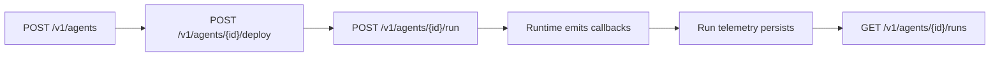

This guide covers the agent management API exposed by Strait.

The agent API is the control-plane surface for:

- creating and updating agent definitions
- deploying versioned runtime targets
- triggering agent runs
- listing the runs associated with an agent

It is intentionally separate from the runtime callback API used by executing agents. Runtime code should use `@strait/agents-sdk`, not these endpoints.

## Mental Model

An agent is a managed resource layered on top of the existing job/run substrate.

That means:

- creating an agent also creates a hidden backing job
- triggering an agent creates a normal run
- runtime telemetry still lands in `run_usage`, `run_checkpoints`, and `run_tool_calls`
- workflows and dashboards continue to use the standard Strait run model

## Authentication

These endpoints use normal management API authentication, not a run token.

Typical request shape:

```bash
curl -sS "$STRAIT_API_URL/v1/agents" \
  -H "Authorization: Bearer $STRAIT_API_KEY" \
  -H "Content-Type: application/json"
```

## Endpoints

| Endpoint | Method | Purpose |
| :--- | :--- | :--- |
| `/v1/agents` | `POST` | Create an agent |
| `/v1/agents` | `GET` | List agents in a project |
| `/v1/agents/{agentID}` | `GET` | Fetch a single agent |
| `/v1/agents/{agentID}` | `PATCH` | Update an agent |
| `/v1/agents/{agentID}` | `DELETE` | Delete an agent |
| `/v1/agents/{agentID}/deploy` | `POST` | Create a new deployment version |
| `/v1/agents/{agentID}/run` | `POST` | Trigger a run |
| `/v1/agents/{agentID}/runs` | `GET` | List runs tied to the agent |

## Create an Agent

```bash
curl -sS "$STRAIT_API_URL/v1/agents" \
  -H "Authorization: Bearer $STRAIT_API_KEY" \
  -H "Content-Type: application/json" \
  -d '{
    "project_id":"proj_123",
    "name":"Incident Triage Agent",
    "slug":"incident-triage",
    "description":"Classifies incidents and suggests next actions.",
    "model":"gpt-5.4-mini",
    "config":{
      "sandbox":{
        "policy":{
          "allow_hosts":["api.openai.com"],
          "default_action":"deny",
          "network_class":"restricted",
          "policy_tag":"triage"
        }
      }
    }
  }'
```

Important fields:

- `project_id`
  - ownership boundary for the agent
- `name`
  - display name
- `slug`
  - stable human-readable identifier within the project
- `model`
  - default model string stored on the agent
- `config`
  - arbitrary JSON object used by the runtime and provider path

The `config` field must be valid JSON and must decode to an object, not a primitive or array.

## List and Inspect Agents

List agents:

```bash
curl -sS "$STRAIT_API_URL/v1/agents?limit=20" \
  -H "Authorization: Bearer $STRAIT_API_KEY" \
  -H "X-Project-ID: proj_123"
```

Fetch one agent:

```bash
curl -sS "$STRAIT_API_URL/v1/agents/$AGENT_ID" \
  -H "Authorization: Bearer $STRAIT_API_KEY" \
  -H "X-Project-ID: proj_123"
```

The response includes the hidden backing `job_id`. Treat that field as an implementation detail, not a public integration point.

## Update an Agent

```bash
curl -sS -X PATCH "$STRAIT_API_URL/v1/agents/$AGENT_ID" \
  -H "Authorization: Bearer $STRAIT_API_KEY" \
  -H "X-Project-ID: proj_123" \
  -H "Content-Type: application/json" \
  -d '{
    "description":"Classifies incidents, suggests next actions, and emits handoff notes.",
    "model":"gpt-5.4"
  }'
```

Only the provided fields are updated. If `config` is sent, it replaces the stored config blob.

## Deploy an Agent

```bash
curl -sS -X POST "$STRAIT_API_URL/v1/agents/$AGENT_ID/deploy" \
  -H "Authorization: Bearer $STRAIT_API_KEY" \
  -H "X-Project-ID: proj_123"
```

Each deploy creates a new `agent_deployments` version.

Provider behavior depends on environment:

- local mode
  - uses the local runtime path and provider metadata
- Cloudflare mode
  - uploads a versioned runtime Worker and stores namespace/script metadata

Deployment responses include:

- `version`
- `status`
- `provider`
- `config_snapshot`
- `provider_metadata`

## Trigger a Run

```bash
curl -sS -X POST "$STRAIT_API_URL/v1/agents/$AGENT_ID/run" \
  -H "Authorization: Bearer $STRAIT_API_KEY" \
  -H "X-Project-ID: proj_123" \
  -H "Content-Type: application/json" \
  -d '{
    "payload":{
      "topic":"billing regression",
      "severity":"high"
    }
  }'
```

This creates a standard run and dispatches it through the latest deployed agent target.

The returned object is a normal run record, which means it follows the same run lifecycle and status model as any other Strait execution.

## List Agent Runs

```bash
curl -sS "$STRAIT_API_URL/v1/agents/$AGENT_ID/runs?limit=20&offset=0" \
  -H "Authorization: Bearer $STRAIT_API_KEY" \
  -H "X-Project-ID: proj_123"
```

Use this endpoint to inspect the runs associated with an agent without needing to resolve the hidden backing job manually.

## Typical Lifecycle



## Error Semantics

Common API errors:

- `400 Bad Request`
  - invalid JSON config
  - invalid pagination
  - missing required fields
- `403 Forbidden`
  - project mismatch or missing access
- `404 Not Found`
  - unknown agent or deployment
- `409 Conflict`
  - duplicate slug
  - trying to run an undeployed agent
- `500 Internal Server Error`
  - unexpected deploy or dispatch failure

## Local-First Workflow

For contributors, the easiest loop is:

1. start Docker
2. run `apps/strait`
3. run `apps/app`
4. create an agent in the dashboard or with the API
5. deploy it
6. trigger it
7. inspect runs, checkpoints, usage, and tool calls

Use these guides with this API:

- [Agents](/docs/concepts/agents)
- [Local Agent Development](/docs/guides/local-agent-development)
- [Agents SDK](/docs/sdks/agents)
- [Cloudflare Agents Productionization](/docs/guides/cloudflare-agents-productionization)
