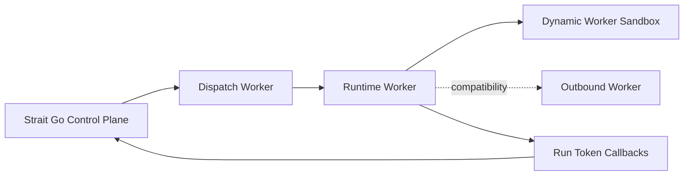

This guide covers the production Cloudflare path for Strait agents.

It maps directly to the current acceptance scope for:

- `STR-289` Go control plane integration
- `STR-297` runtime Worker and dispatch Worker entrypoints
- `STR-294` Dynamic Workers sandboxing with outbound-worker compatibility

## System Diagram



## Architecture

The production path has three Cloudflare Worker entrypoints in `apps/agents`:

1. runtime Worker
2. dispatch Worker
3. outbound Worker

And one default sandbox execution mode:

4. Dynamic Workers via the runtime worker loader binding

The control plane remains in Go:

1. Strait deploys a versioned user Worker into a dispatch namespace.
2. Strait triggers the dispatch Worker with a signed internal request.
3. The dispatch Worker resolves the deployed runtime Worker by script name.
4. The runtime Worker emits checkpoints, usage, stream chunks, tool calls, and terminal state.
5. The dispatch Worker forwards those callbacks back to Strait.
6. Sandboxed tool execution runs in Dynamic Workers by default.
7. Outbound-worker routing stays available when an environment explicitly selects compatibility mode.

## Shared vs Versioned Components

Shared infrastructure:

- dispatch Worker
- outbound Worker
- dispatch namespace

Versioned per deployment:

- runtime Worker script
- provider metadata stored on the deployment record
- sandbox policy snapshot

## Required Preparation

1. Set the Cloudflare env vars in Strait:
   - `CF_ACCOUNT_ID`
   - `CF_API_TOKEN`
   - `CF_DISPATCH_NAMESPACE`
   - `CF_DISPATCH_WORKER_URL`
   - `CF_COMPATIBILITY_DATE`
   - `CF_SANDBOX_MODE=dynamic_worker`
   - `CF_OUTBOUND_WORKER_NAME` only if you intentionally want outbound-worker compatibility mode
2. Build the worker bundles:

```bash
cd apps/agents
bun run build
```

3. Deploy the shared Workers:

```bash
cd apps/agents
bun run deploy:outbound
bun run deploy:dispatch
```

Recommended order:

1. build all bundles
2. deploy dispatch Worker
3. deploy outbound Worker if you use fallback/compatibility mode
4. deploy an agent from Strait
5. trigger a smoke run

The runtime Worker is uploaded by the Go control plane during agent deployment. Strait prefers the built bundle at `apps/agents/dist/runtime/worker.js` and falls back to the embedded runtime snapshot in [runtime_worker_bundle.js](/Users/leonardomaldonado/.codex/worktrees/0556/strait/apps/strait/internal/agents/runtime_worker_bundle.js).

## Required Runtime Metadata

Cloudflare deployment metadata should include:

- provider kind
- namespace
- script name
- deployment version
- dispatch worker URL
- compatibility date
- sandbox policy snapshot
- runtime bundle hash or etag

## Deploy and Run Smoke Commands

Assume:

- `STRAIT_API_URL` points to the Go API
- `STRAIT_API_KEY` is a bearer token with access to the target project
- `PROJECT_ID` is the project that owns the smoke agent

Create an agent:

```bash
curl -sS "$STRAIT_API_URL/v1/agents" \
  -H "Authorization: Bearer $STRAIT_API_KEY" \
  -H "Content-Type: application/json" \
  -d '{
    "project_id":"'"$PROJECT_ID"'",
    "name":"Cloudflare Smoke Agent",
    "slug":"cloudflare-smoke-agent",
    "model":"gpt-5.4",
    "config":{
      "sandbox":{
        "policy":{
          "allow_hosts":["api.openai.com"],
          "default_action":"deny",
          "network_class":"sandbox",
          "policy_tag":"smoke"
        }
      }
    }
  }'
```

Deploy the agent:

```bash
curl -sS -X POST "$STRAIT_API_URL/v1/agents/$AGENT_ID/deploy" \
  -H "Authorization: Bearer $STRAIT_API_KEY"
```

Trigger a happy-path run:

```bash
curl -sS -X POST "$STRAIT_API_URL/v1/agents/$AGENT_ID/run" \
  -H "Authorization: Bearer $STRAIT_API_KEY" \
  -H "Content-Type: application/json" \
  -d '{"payload":{"prompt":"hello from cloudflare"}}'
```

Trigger a blocked-egress run:

```bash
curl -sS -X POST "$STRAIT_API_URL/v1/agents/$AGENT_ID/run" \
  -H "Authorization: Bearer $STRAIT_API_KEY" \
  -H "Content-Type: application/json" \
  -d '{"payload":{"_network_url":"https://blocked.example.com"}}'
```

## Expected Run Semantics

Successful dispatch and runtime execution should produce:

- a normal run record
- at least one checkpoint when the runtime emits one
- usage telemetry in `run_usage`
- tool telemetry in `run_tool_calls`

Dispatch-level failures before runtime startup should map to `system_failed`.

Runtime-level failures after startup should map according to the emitted runtime event:

- explicit runtime failure event -> `failed`
- malformed runtime contract or disconnect -> `system_failed`

## Staging Dogfood Checklist

- Build all worker bundles successfully with `bun run build`.
- Deploy the dispatch Worker, and deploy the outbound Worker only if you want compatibility mode.
- Create a fresh agent with a Dynamic Workers policy allowlist.
- Deploy the agent and confirm `agent_deployments.provider_metadata` contains:
  - namespace
  - script name
  - dispatch worker URL
  - compatibility date
  - sandbox policy
- Trigger a normal run and confirm:
  - run reaches `completed`
  - `run_usage` row exists
  - `run_checkpoints` row exists
  - `run_tool_calls` row exists
- Trigger a blocked-egress run and confirm:
  - run telemetry contains `tool_name=sandbox.fetch`
  - tool call status is `blocked`
  - blocked host and reason are visible
- Delete or redeploy the agent and confirm the versioned script is removed or replaced in the dispatch namespace.

## Troubleshooting

If deploys fail before the remote run starts:

- verify `CF_DISPATCH_NAMESPACE`
- verify `CF_API_TOKEN`
- verify the built runtime bundle exists
- verify the dispatch Worker URL points to the deployed dispatch Worker

If runs dispatch but callbacks fail:

- verify `INTERNAL_SECRET` is shared between Strait and the dispatch Worker
- verify the run token callback endpoints are reachable from the dispatch Worker
- check for `runtime_callback_failed` responses from the dispatch Worker

If egress is unexpectedly blocked:

- inspect the agent config `sandbox.policy`
- inspect `sandbox_policy` inside `agent_deployments.provider_metadata`
- verify the target host is present in `allow_hosts`
- check the sandbox telemetry and, in outbound-worker compatibility mode, the outbound Worker response headers:
  - `x-strait-outbound-status`
  - `x-strait-outbound-reason`
  - `x-strait-outbound-policy-tag`

## Related References

- [Agents](/docs/concepts/agents)
- [Agent API Guide](/docs/guides/agent-api)
- [Agents SDK](/docs/sdks/agents)
- [Local Agent Development](/docs/guides/local-agent-development)
