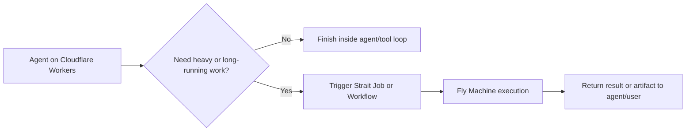

Strait now has two execution products on one platform:

- **Jobs** for durable background execution and workflow orchestration on Fly Machines
- **Agents** for LLM-centric orchestration, tool calling, and real-time streaming on Cloudflare Workers

They share the same project model, authentication, telemetry pipeline, dashboard, and billing account. The important distinction is execution shape.

They should be treated as two product surfaces on one platform:

- one shared Strait account
- shared projects, auth, and observability
- separate execution models
- separate usage envelopes and pricing stories

In other words, Jobs and Agents belong together operationally, but users should still choose between them intentionally instead of treating agents as a replacement for Fly-backed execution.

## Use Jobs When

Choose Jobs when the work is compute-heavy, long-running, or container-dependent:

- video processing
- ETL and data pipelines
- ML inference that needs custom system packages or GPUs
- cron and scheduled maintenance
- webhook consumers and generic backend tasks
- workloads that may run for minutes or hours

Jobs are the right fit when wall-clock duration and environment flexibility matter more than instant startup.

## Use Agents When

Choose Agents when the work is LLM-centric, interactive, and mostly I/O-bound:

- tool-calling assistants
- real-time token streaming to the UI
- prompt orchestration and routing
- planner / worker / judge patterns
- cost- and token-budgeted model loops
- lightweight tools that benefit from fast isolate startup

Agents are the right fit when latency, incremental output, and LLM telemetry matter more than Linux/container flexibility.

## Use Agents To Trigger Jobs

This is the most important combined pattern.

Use an Agent to handle:

- prompt interpretation
- model/tool selection
- short-lived reasoning
- deciding whether heavier execution is needed

Then hand off to Jobs for:

- CPU-heavy processing
- long-running batch steps
- third-party tools that require full container images
- fan-out workflows that should execute durably on the existing workflow engine

The combined flow looks like this:

## Quick Decision Table

| Question | Prefer Jobs | Prefer Agents |
| --- | --- | --- |
| Does it need Docker or system packages? | Yes | No |
| Is it mostly waiting on LLM/network I/O? | No | Yes |
| Does it need token streaming? | Rarely | Yes |
| Could it run for minutes or hours? | Yes | Sometimes, but Jobs usually fit better |
| Is the core loop model/tool orchestration? | No | Yes |
| Is the work heavy compute or batch processing? | Yes | No |

## Architecture Boundary

The current implementation keeps the boundary explicit:

- Jobs are still the primary durable execution substrate
- Agents reuse the same run and telemetry tables through a higher-level control plane
- Agents can orchestrate workflows without inventing a second workflow engine
- Agents should escalate to Jobs when they leave the low-latency, I/O-heavy path

## Migration Path

If you have existing jobs that are primarily LLM-centric (prompt in, structured output out), they may be better served as agents. See [Migrating Jobs to Agents](/guides/migrating-jobs-to-agents) for a step-by-step guide covering identification, SDK setup, deployment, testing, cutover, and rollback.

## Recommended Starting Points

- [Jobs](/docs/concepts/jobs)
- [Agents](/docs/concepts/agents)
- [Workflows](/docs/concepts/workflows)
- [Local Agent Development](/docs/guides/local-agent-development)

For a concrete reference implementation of the handoff pattern, see:

- `packages/agents-sdk/examples/agent-escalates-to-workflow.ts`
